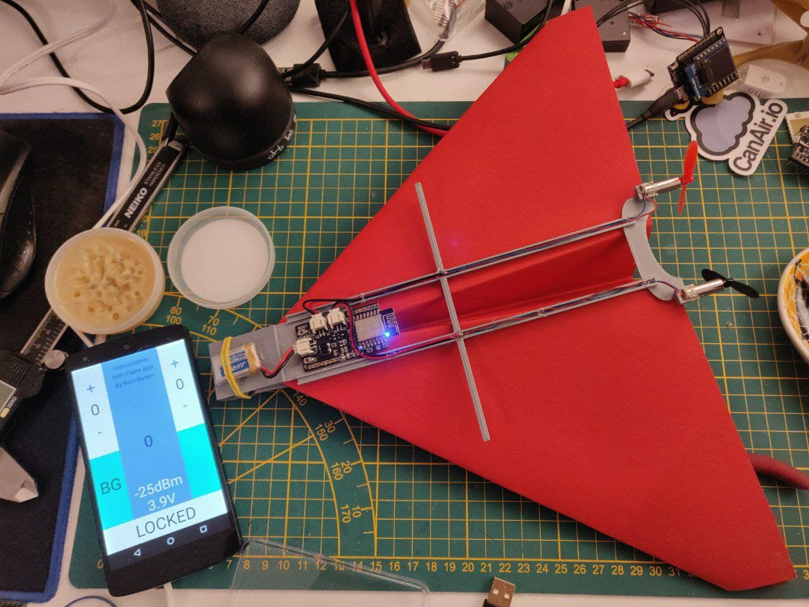
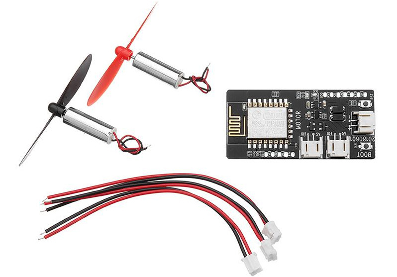
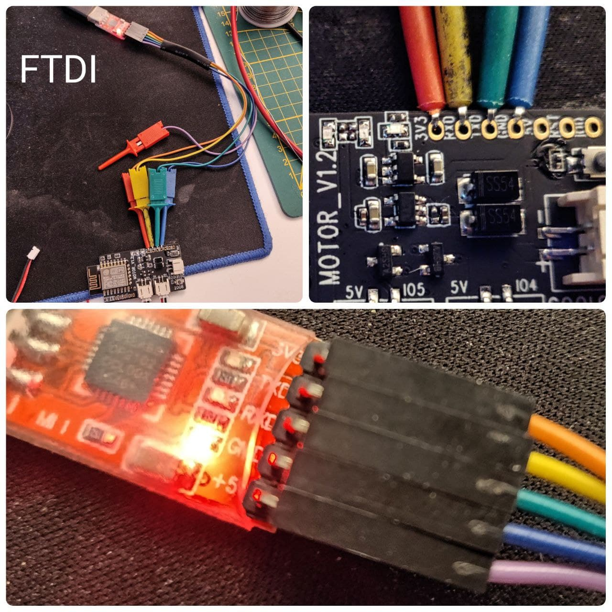

# esp8266-tiny-airplane

A tiny Airplane with a [esp8266 TTGO T-Thruster board](https://www.aliexpress.com/item/32886527246.html) joined to a Android joystick app or M5StickC joystick.  

**W A R N I N G:** 

- Only the joystick version needs upload this firmware, but the board already have a factory firmware that works with Android alternative, you don't needs change the firmware in your board.
- The current 3D print models are in testing.

## TODO

- [x] migrated basic code from [ESP8266 RC Plane](https://www.instructables.com/WIFI-CONTROLLED-RC-PLANE/)
- [x] migrated CanAirIO OTA Handler to ESP8266
- [x] PlatformIO project with OTA support and FTDI (USB) support
- [x] Tested with original Android APK [OK]
- [x] Airplane of paper (3D Print) [untested]
- [ ] 3D print wing (in development)
- [ ] UDP control with nano protos 

## FTDI connection (optional for joystick version or OTA)

For upload the code, you need have a serial connection, with a simple FTDI or another ESP8266 you can do it. The next image show the basic connection to USB FTDI:

